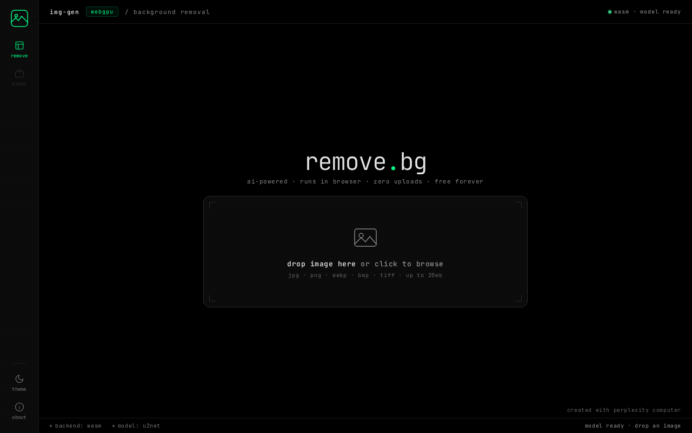
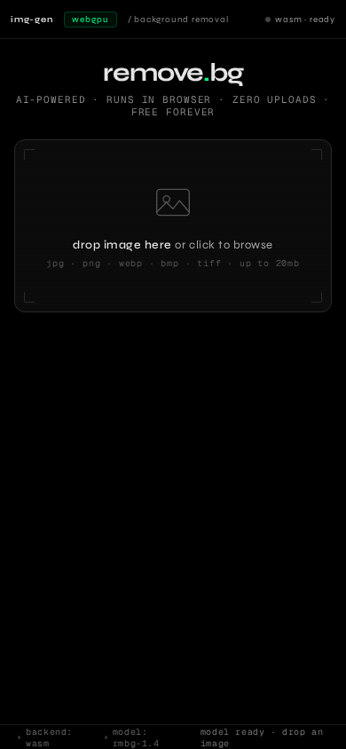

<div align="center">

<br/>

```
██╗███╗   ███╗ ██████╗       ██████╗ ███████╗███╗   ██╗
██║████╗ ████║██╔════╝      ██╔════╝ ██╔════╝████╗  ██║
██║██╔████╔██║██║  ███╗     ██║  ███╗█████╗  ██╔██╗ ██║
██║██║╚██╔╝██║██║   ██║     ██║   ██║██╔══╝  ██║╚██╗██║
██║██║ ╚═╝ ██║╚██████╔╝     ╚██████╔╝███████╗██║ ╚████║
╚═╝╚═╝     ╚═╝ ╚═════╝       ╚═════╝ ╚══════╝╚═╝  ╚═══╝
```

**remove backgrounds. in your browser. for free. forever.**

[](https://img00.pages.dev)
[](LICENSE)
[](https://huggingface.co/briaai/RMBG-1.4)
[](https://onnxruntime.ai)

<br/>



<br/>

</div>

---

## what is this

Drop an image. Get a transparent PNG back. No sign-up. No upload. No watermark. No server ever sees your photo — the AI runs directly in your browser using WebGPU or WASM.

Powered by [RMBG-1.4](https://huggingface.co/briaai/RMBG-1.4) (BiRefNet-lite by BRIA AI), loaded as an ONNX model and executed via [ONNX Runtime Web](https://onnxruntime.ai). The model downloads once (~170 MB), gets cached by the browser, and loads instantly every time after.

---

## features

| | |
|---|---|
| runs offline | after first model load, zero network required |
| webgpu accelerated | GPU inference on Chrome 113+, WASM fallback elsewhere |
| original resolution | output is full-res, no downscaling |
| transparent PNG | alpha channel preserved, ready for any editor |
| no install | pure HTML/CSS/JS — open in browser and go |
| no limits | process as many images as you want |

---

## use it

**Hosted** — open in Chrome, drop your image, done:

> [img00.pages.dev](https://img00.pages.dev)

**Self-hosted** — must be served over HTTP, not `file://`:

```bash
git clone https://github.com/YashasVM/Img-gen.git
cd Img-gen
npx serve .
```

Then open `http://localhost:3000` in Chrome.

---

## browser support

| browser | webgpu | wasm |
|---|:---:|:---:|
| Chrome 113+ | ✓ | ✓ |
| Edge 113+ | ✓ | ✓ |
| Firefox | — | ✓ |
| Safari 17+ | partial | ✓ |

WebGPU is 3–10x faster depending on your GPU. WASM works everywhere but is slower on large images.

---

## screenshots

<table>
  <tr>
    <td></td>
    <td></td>
  </tr>
  <tr>
    <td align="center">desktop</td>
    <td align="center">mobile</td>
  </tr>
</table>

---

## how it works

```
image input
    │
    ▼
createImageBitmap()          ← async decode, off main thread
    │
    ▼
resize to 512×512            ← single-pass OffscreenCanvas
normalize (ImageNet stats)   ← precomputed reciprocals, one loop
    │
    ▼
ONNX Runtime Web             ← WebGPU or WASM execution
RMBG-1.4 inference           ← outputs single-channel alpha mask
    │
    ▼
scale mask → original res    ← bilinear interpolation
apply as alpha channel       ← pixel-level compositing
    │
    ▼
canvas.toBlob()              ← non-blocking PNG export
```

---

## stack

```
frontend    vanilla HTML / CSS / JS
model       RMBG-1.4 (BRIA AI) — ONNX format
runtime     ONNX Runtime Web 1.20.1
hosting     Cloudflare Pages
fonts       Syne + Geist Mono
```

---

## local dev notes

- The app uses `fetch()` to load the model from HuggingFace — this requires CORS headers, which `file://` URLs don't send. Always serve with `npx serve` or any HTTP server.
- The `_headers` file sets `Cross-Origin-Opener-Policy` and `Cross-Origin-Embedder-Policy` for Cloudflare Pages, which unlocks WASM multi-threading.
- Inference runs at 512×512 input for speed. The original image resolution is preserved in the output.

---

## license

MIT — do whatever you want with it.

---

<div align="center">
  <sub>built by <a href="https://github.com/YashasVM">YashasVM</a></sub>
</div>
